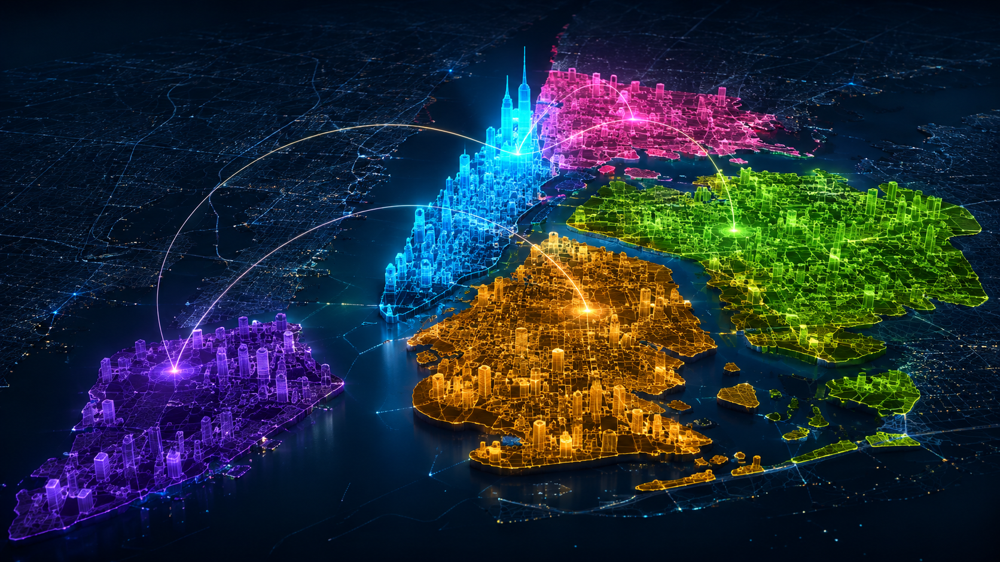

# Electric City

**City of Dreams — Manhattan's real 3D skyline recoded in neon.**

Electric City streams the detailed public Manhattan building model and applies
a Python-generated synthwave renderer. Low-rise blocks glow cyan, mid-rise
buildings shift through violet, towers burn magenta, and the tallest landmarks
catch the orange horizon.



## The idea

The mood comes from a 1990s arcade racer at midnight: an endless city ahead,
sharp neon edges, and Manhattan rising out of the dark. The geometry is not a
fantasy approximation. Electric City uses the same public 3D object SceneLayer
as [Esri's Manhattan Skyscraper Explorer][esri-explorer], derived from NYC's
[official model][3d-model].
That means landmark roof forms—including One World Trade Center—emerge from
the source mesh instead of being pasted on as synthetic shapes.

Python owns the reproducible experience: it defines the height classes,
materials, cameras, interface, source URLs, and generates the deployable page.
The browser uses the ArcGIS Maps SDK to stream the I3S mesh progressively, which
is far more detailed and efficient than downloading the complete CityGML archive.

## Run it

```bash
python -m venv .venv
source .venv/bin/activate
pip install -e '.[dev]'
python scripts/build_demo.py
python -m http.server 8765 -d docs
```

Open `http://localhost:8765`, orbit the city, select a building, or jump between
the Skyline, Downtown, Midtown, and Uptown camera presets.

The optional Streamlit studio wraps the same Python-generated scene:

```bash
streamlit run app.py
```

## Public-data audit

`scripts/fetch_manhattan.py` is an independent, paged Python importer for NYC
OTI's maintained [Building Footprints API][footprints]. It currently returns 45,059 Manhattan
footprints with plausible roof heights and is useful for validation or analysis:

```bash
python scripts/fetch_manhattan.py
```

The live 3D experience uses the richer mesh source because footprint extrusion
cannot reproduce the roof geometry visible in the official model.

## Data notes

- Live geometry: public `Buildings_Manhattan` I3S SceneLayer
- Original source: NYC 3-D Building Model, based on the 2014 aerial survey
- Model detail: hybrid CityGML LOD 1/2 with landmark roof structures
- Theme field: `HEIGHTROOF`, classified by the Python build configuration
- Popups: building name, roof height, and construction year
- Footprint audit: NYC OTI Building Footprints API, fetched in concurrent pages
- Visual colors: artistic height classes, not statistical categories

Public data remains subject to the [NYC Open Data Terms of Use][terms]. The
scene-layer service and reference implementation are credited to Esri.

## Stack

Python · ArcGIS Maps SDK for JavaScript · I3S SceneLayer · Streamlit · NYC Open Data · pytest

[3d-model]: https://data.cityofnewyork.us/City-Government/3-D-Building-Model/tnru-abg2
[footprints]: https://data.cityofnewyork.us/d/3g6p-4u5s
[esri-explorer]: https://esri.github.io/Manhattan-skyscraper-explorer/
[terms]: https://opendata.cityofnewyork.us/overview/#termsofuse
